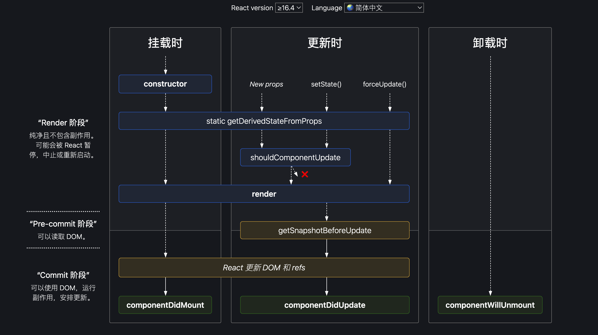
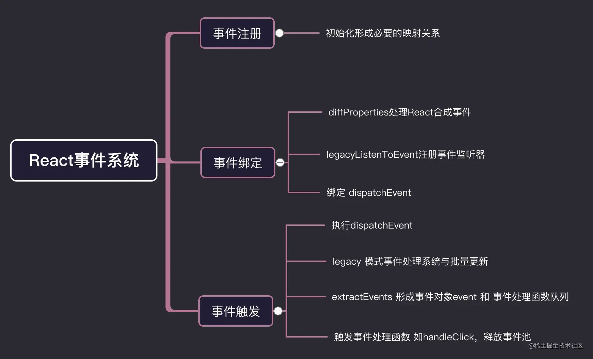
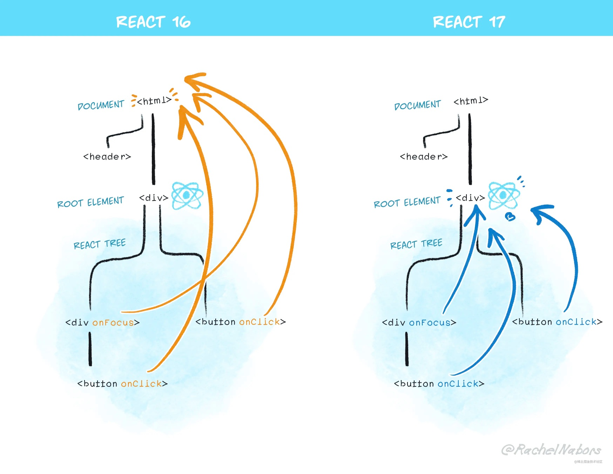
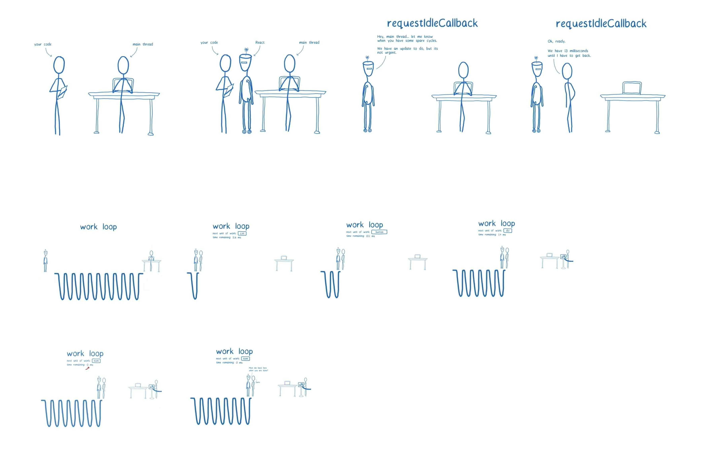

# React

- [官网](https://react.dev/)
- https://juejin.cn/post/6941546135827775525
- https://juejin.cn/post/6940942549305524238

### React 设计思想

[react 设计模式](https://juejin.cn/post/7007214462813863950)

1. 组件化
   每个组件都符合开放-封闭原则:

- 封闭是针对渲染工作流来说的，指的是组件内部的状态都由自身维护，只处理内部的渲染逻辑。
- 开放是针对组件通信来说的，指的是不同组件可以通过 props（单项数据流）进行数据交互

2. 数据驱动视图

- 公式： UI=f(data)
- 通过这个公式得出，如果要渲染界面，不应该直接操作 DOM，而是通过修改数据(state 或 prop)，数据驱动视图更新

3. 虚拟 DOM

### JSX

> JSX 是 react 的语法糖，它允许在 html 中写 JS，它不能被浏览器直接识别，需要通过 webpack、babel 之类的编译工具转换为 JS 执行

JSX 与 JS 的区别：

- js 可以被打包工具直接编译，不需要额外转换，jsx 需要通过 babel 编译，它是 React.createElement 的语法糖，使用 jsx 等价于 React.createElement
- jsx 是 js 的语法扩展，允许在 html 中写 JS；JS 是原生写法，需要通过 script 标签引入

#### 为什么在文件中没有使用 react，也要在文件顶部 import React from “react”

只要使用了 jsx，就需要引用 react，因为 jsx 本质就是 React.createElement

#### 为什么 React 自定义组件首字母要大写

- jsx 通过 babel 转义时，调用了 React.createElement 函数，它接收三个参数，分别是 type 元素类型，props 元素属性，children 子元素。
- 如下代码中，从 jsx 到真实 DOM 需要经历`jsx->虚拟DOM->真实DOM`。如果组件首字母为小写，它会被当成字符串进行传递，在创建虚拟 DOM 的时候，就会把它当成一个 html 标签，而 html 没有 app 这个标签，就会报错。组件首字母为大写，它会当成一个变量进行传递，React 知道它是个自定义组件就不会报错了

```jsx | pure
<app>app content</app>
// 转义后
React.createElement("app",null,"app content")

<App>app content</App>
// 转义后
React.createElement(App,null,'app content')
```

#### React 组件为什么不能返回多个元素 或者 React 组件为什么只能有一个根元素

1. React 组件最后会编译为 render 函数，函数的返回值只能是 1 个，如果不用单独的根节点包裹，就会并列返回多个值，这在 js 中是不允许的

```jsx | pure
class App extends React.Component {
  render() {
    return (
      <div>
        <h1 className="title">内容1</h1>
        <span>内容2</span>
      </div>
    );
  }
}

//编译后
class App extends React.Component {
  render() {
    return React.createElement('div', null, [
      React.createElement('h1', { className: 'title' }, '内容1'),
      React.createElement('span'),
      null,
      '内容2',
    ]);
  }
}
```

2. react 的虚拟 DOM 是一个树状结构，树的根节点只能是 1 个，如果有多个根节点，无法确认是在哪棵树上进行更新(vue 的根节点为什么只有一个也是同样的原因)

#### React 组件怎样可以返回多个组件

- 使用 HOC（高阶函数）
- 使用 React.Fragment,可以让你将元素列表加到一个分组中，而且不会创建额外的节点（类似 vue 的 template)

```jsx | pure
renderList(){
  this.state.list.map((item,key)=>{
    return (<React.Fragment>
      <tr key={item.id}>
        <td>{item.name}</td>
        <td>{item.age}</td>
        <td>{item.address}</td>
      </tr>
    </React.Fragment>)
  })
}
```

- 使用数组返回

```jsx | pure
renderList(){
  this.state.list.map((item,key)=>{
    return [
      <tr key={item.id}>
        <td>{item.name}</td>
        <td>{item.age}</td>
        <td>{item.address}</td>
      </tr>
    ]
  })
}
```

#### Babel 插件是如何实现 JSX 到 JS 的编译 ？

1. 依赖：

- @babel/cli
- @babel/core
- @babel/preset-react

2. babel.rc 文件添加配置：

```json | pure
{
  "presets": ["@babel/preset-react"]
}
```

3. Babel 读取代码并解析，生成 AST，再将 AST 传入插件层进行转换，在转换时就可以将 JSX 的结构转换为 React.createElement 的函数。
   - `React.createElement(type, props, children)` 源码

```js | pure
export function createElement(type, config, children) {
  // propName 变量用于储存后面需要用到的元素属性
  let propName;
  // props 变量用于储存元素属性的键值对集合
  const props = {};
  // key、ref、self、source 均为 React 元素的属性，此处不必深究
  let key = null;
  let ref = null;
  let self = null;
  let source = null;

  // config 对象中存储的是元素的属性
  if (config != null) {
    // 进来之后做的第一件事，是依次对 ref、key、self 和 source 属性赋值
    if (hasValidRef(config)) {
      ref = config.ref;
    }
    // 此处将 key 值字符串化
    if (hasValidKey(config)) {
      key = '' + config.key;
    }

    self = config.__self === undefined ? null : config.__self;
    source = config.__source === undefined ? null : config.__source;

    // 接着就是要把 config 里面的属性都一个一个挪到 props 这个之前声明好的对象里面
    for (propName in config) {
      if (
        // 筛选出可以提进 props 对象里的属性
        hasOwnProperty.call(config, propName) &&
        !RESERVED_PROPS.hasOwnProperty(propName)
      ) {
        props[propName] = config[propName];
      }
    }
  }
  // childrenLength 指的是当前元素的子元素的个数，减去的 2 是 type 和 config 两个参数占用的长度
  const childrenLength = arguments.length - 2;
  // 如果抛去type和config，就只剩下一个参数，一般意味着文本节点出现了
  if (childrenLength === 1) {
    // 直接把这个参数的值赋给props.children
    props.children = children;
    // 处理嵌套多个子元素的情况
  } else if (childrenLength > 1) {
    // 声明一个子元素数组
    const childArray = Array(childrenLength);
    // 把子元素推进数组里
    for (let i = 0; i < childrenLength; i++) {
      childArray[i] = arguments[i + 2];
    }
    // 最后把这个数组赋值给props.children
    props.children = childArray;
  }

  // 处理 defaultProps
  if (type && type.defaultProps) {
    const defaultProps = type.defaultProps;
    for (propName in defaultProps) {
      if (props[propName] === undefined) {
        props[propName] = defaultProps[propName];
      }
    }
  }

  // 最后返回一个调用ReactElement执行方法，并传入刚才处理过的参数
  return ReactElement(
    type,
    key,
    ref,
    self,
    source,
    ReactCurrentOwner.current,
    props,
  );
}
```

- ReactElement 其实只做了一件事情，那就是“创建”，说得更精确一点，是“组装”：ReactElement 把传入的参数按照一定的规范，“组装”进了 element 对象里，并把它返回给了 React.createElement，最终 React.createElement 又把它交回到了开发者手中。
- ReactElement 返回的 element 其实就是虚拟 DOM 中的一个节点：一个 JS 对象，这个对象包含了对真实节点的描述。

### setState

执行机制：

- 不会立即更新，多个 setState 会进行合并，当所有组件及父组件 Didmoount 后，执行更行
- 每个组件只会更新一次，即对该组件的状态多次 setState，进行合并后触发一次更新的生命周期。

和微任务、宏任务的区别：

- 执行顺序：setState 操作执行时机先于微任务和宏任务。
- setState 的异步特性的主要原因：在 React 的声明周期及绑定的事件流中，所有的 setState 的操作会先缓存到一个队列中，等整个事件结束或者 mount 流程结束后，才会去除之前缓存的 setState 队列进行一次计算，触发 state 更新

```js | pure
handleClick = () => {
  const fans = Math.floor(Math.random() * 10); // 8
  this.setState(
    {
      count: this.state.count + fans, // 0 + 8
    },
    () => {
      console.log('state:', this.state.count);
    },
  );
  setTimeout(() => {
    console.log('宏任务');
  });
  Promise.resolve().then(() => {
    console.log('微任务');
  });
};
// 打印结果：
//    微任务 state:8 宏任务
```

- 跳出 React 的事件流或生命周期，就可打破 React 对 setState 的掌控，即把 setState 放入 setTimeout 的匿名函数即可

```js | pure
handleClick = () => {
  const fans = Math.floor(Math.random() * 10); // 8
  setTimeout(() => {
    console.log('开始');
    this.setState(
      {
        count: this.state.count + fans, // 0 + 8
      },
      () => {
        console.log('state:', count);
      },
    );
    console.log('结束');
  }, 0);
};
// 打印结果：
// 开始 state:8  结束
```

### 生命周期

> 参考：https://zh-hans.reactjs.org/docs/react-component.html



- 挂载阶段: 当组件实例被创建并插入 DOM 中时，其生命周期调用顺序如下

  - constructor() ：进行 state、props 初始化。该阶段修改 state，不会执行更新阶段声明周期，可直接对 state 赋值
  - static getDerivedStateFromProps()
  - render()
  - componentDidMount() ： 发生在 render 函数之后，已经挂载 Dom
    > 注意：
    > UNSAFE_componentWillMount() ：发生在 render 函数之前，还没有挂载 Dom. 即将过时，在新代码中应该避免使用它们.

- 更新阶段: 当组件的 props 或 state 发生变化时会触发更新。组件更新的生命周期调用顺序如下
  - static getDerivedStateFromProps()
  - shouldComponentUpdate()
  - render()
  - getSnapshotBeforeUpdate()
  - componentDidUpdate()

> 注意：
> UNSAFE_componentWillUpdate()
> UNSAFE_componentWillReceiveProps()
> 这两个方法即将过时，在新代码中应该避免使用它们

- 卸载阶段：当组件从 DOM 中移除时会调用如下方法

  - componentWillUnmount()

- 错误处理: 当渲染过程，生命周期，或子组件的构造函数中抛出错误时，会调用如下方法
  - static getDerivedStateFromError()
  - componentDidCatch()

### 虚拟 dom

> 参考：https://zh-hans.reactjs.org/docs/faq-internals.html

#### 理解

- JS 对象，保存在内存中
- 是对真实 dom 的映射

#### 工作流程

- 挂载阶段：React 将结合 JSX 的描述，构建出虚拟 DOM 树，然后通过 ReactDOM.render 实现虚拟 DOM 到真实 DOM 的映射（触发渲染流水线）；
- 更新阶段：页面的变化先作用于虚拟 DOM，虚拟 DOM 将在 JS 层借助算法先对比出具体有哪些真实 DOM 需要被改变，然后再将这些改变作用于真实 DOM。

#### 虚拟 dom 解决的关键问题

- 减少 DOM 操作：虚拟 DOM 可以将多次 DOM 操作合并为一次操作
- 研发体验/研发效率的问题：虚拟 DOM 的出现，为数据驱动视图这一思想提供了高度可用的载体，使得前端开发能够基于函数式 UI 的编程方式实现高效的声明式编程。
- 跨平台的问题：虚拟 DOM 是对真实渲染内容的一层抽象。同一套虚拟 DOM，可以对接不同平台的渲染逻辑，从而实现“一次编码，多端运行”
- 性能优化的问题：虚拟 DOM 的出现，为前端性能优化提供了一种思路，即通过对比新旧虚拟 DOM 的差异，来减少真实 DOM 的操作，从而提升性能。

#### VDOM 和 DOM 的区别

- 真实 DOM 存在重排和重绘，虚拟 DOM 不存在；
- 虚拟 DOM 的总损耗是“虚拟 DOM 增删改+真实 DOM **差异**增删改+排版与重绘（可能比直接操作真实 DOM 要少）”，真实 DOM 的总损耗是“真实 DOM 完全增删改+排版与重绘”

:::info{title=注意：}

- 传统的原生 api 或 jQuery 去操作 DOM 时，浏览器会从构建 DOM 树开始从头到尾执行一遍流程。
- 当你在一次操作时，需要更新 10 个 DOM 节点，浏览器没这么智能，收到第一个更新 DOM 请求后，并不知道后续还有 9 次更新操作，因此会马上执行流程，最终执行 10 次流程。
- 而通过 VNode，同样更新 10 个 DOM 节点，虚拟 DOM 不会立即操作 DOM，而是将这 10 次更新的 diff 内容保存到本地的一个 js 对象中，最终将这个 js 对象一次性 attach 到 DOM 树上，避免大量的无谓计算。
  :::

#### VDOM 和 DOM 优缺点

- 真实 DOM 的优势：

  - 易用

- 真实 DOM 的缺点：

  - 效率低，解析速度慢，内存占用量过高
  - 性能差：频繁操作真实 DOM，易于导致重绘与回流

- 虚拟 DOM 的优势：

  - 简单方便：如果使用手动操作真实 DOM 来完成页面，繁琐又容易出错，在大规模应用下维护起来也很困难
  - 性能方面：使用 Virtual DOM，能够有效避免真实 DOM 数频繁更新，减少多次引起重绘与回流，提高性能
  - 跨平台：React 借助虚拟 DOM，带来了跨平台的能力，一套代码多端运行

- 虚拟 DOM 的缺点：
  - 在一些性能要求极高的应用中虚拟 DOM 无法进行针对性的极致优化，首次渲染大量 DOM 时，由于多了一层虚拟 DOM 的计算，速度比正常稍慢

### react 事件机制

#### 合成事件

> React 基于浏览器的事件机制实现了一套自身的事件机制，它符合 W3C 规范，包括事件触发、事件冒泡、事件捕获、事件合成和事件派发等

设计动机（作用）：

- 在底层磨平不同浏览器的差异，React 实现了统一的事件机制，我们不再需要处理浏览器事件机制方面的兼容问题，在上层面向开发者暴露稳定、统一的、与原生事件相同的事件接口
- React 把握了事件机制的主动权，实现了对所有事件的中心化管控
- React 引入事件池避免垃圾回收，在事件池中获取或释放事件对象，避免频繁的创建和销毁

**React 事件机制和原生 DOM 事件流有什么区别:**

- 合成事件不是原生 DOM 事件，但它包含了原生 DOM 事件的引用，可以通过 e.nativeEvent 访问

**DOM 事件流工作流程**

> 一个页面往往会绑定多个事件，页面接收事件的顺序叫事件流

1. W3C 标准事件的传播过程:

   1. 事件捕获
   2. 处于目标
   3. 事件冒泡

2. 常用事件处理性能优化手段：**事件委托**
   1. 把多个子元素同一类型的监听函数合并到父元素上，通过一个函数监听的行为叫事件委托
   2. React 事件中， React16 的事件绑定在 document 上， React17 以后事件绑定在 container 上(`ReactDOM.render(app,container)`)

#### React 事件机制总结

- React 所有的事件绑定在 container 上(react17 以后),而不是绑定在 DOM 元素上（作用：减少内存开销，所有的事件处理都在 container 上，其他节点没有绑定事件）
- React 自身实现了一套冒泡机制，不能通过 return false 阻止冒泡
- React 通过 SytheticEvent 实现了事件合成



### React 组件通信

1. 父组件向子组件通信(props)
2. 子组件向父组件通信(回调函数、事件冒泡、ref)
3. 兄弟组件通信(父组件作为中转)
4. 父组件向后代组件通信（context、redux）
5. 无关组件通信

### react16+

#### react16

- jsx 中绑定的事件,根本就没有注册到真实的 dom 上。是绑定在 document 上统一管理的(react16)
- 真实的 dom 上的 click 事件被单独处理,已经被 react 底层替换成空函数
- 在 react 绑定的事件,比如 onChange，在 document 上，可能有多个事件与之对应
- react 并不是一开始，把所有的事件都绑定在 document 上，而是采取了一种按需绑定，比如发现了 onClick 事件,再去绑定 document click 事件。

合成事件：在 react 中，绑定的事件 onClick 等，并不是原生事件，而是由原生事件合成的 React 事件，比如 click 事件合成为 onClick 事件。比如 blur , change , input , keydown , keyup 等 , 合成为 onChange。

采取合成事件的原因：

- 将事件绑定在 document 统一管理，防止很多事件直接绑定在原生的 dom 元素上。造成一些不可控的情况
- React 想实现一个全浏览器的框架， 为了实现这种目标就需要提供全浏览器一致性的事件系统，以此抹平不同浏览器的差异。

事件绑定总结：

- 在 React，diff DOM 元素类型的 fiber 的 props 的时候， 如果发现是 React 合成事件，比如 onClick，会按照事件系统逻辑单独处理。
- 根据 React 合成事件类型，找到对应的原生事件的类型，然后调用判断原生事件类型，大部分事件都按照冒泡逻辑处理，少数事件会按照捕获逻辑处理（比如 scroll 事件）。
- 调用 addTrappedEventListener 进行真正的事件绑定，绑定在 document 上，dispatchEvent 为统一的事件处理函数。
- 有一点值得注意: 只有上述那几个特殊事件比如 scorll,focus,blur 等是在事件捕获阶段发生的，其他的都是在事件冒泡阶段发生的，无论是 onClick 还是 onClickCapture 都是发生在冒泡阶段，

事件池：

```js | pure
handerClick = (e) => {
  console.log(e.target); // button
  setTimeout(() => {
    console.log(e.target); // null, 17之后取消了事件池，解决了找不到e.target的问题
  }, 0);
};
```

- 对于一次点击事件的处理函数，在正常的函数执行上下文中打印 e.target 就指向了 dom 元素，但是在 setTimeout 中打印却是 null，如果这不是 React 事件系统，两次打印的应该是一样的，但是为什么两次打印不一样呢?
- 因为在 React 采取了一个事件池的概念，每次我们用的事件源对象，在事件函数执行之后，可以通过 releaseTopLevelCallbackBookKeeping 等方法将事件源对象释放到事件池中，这样的好处每次我们不必再创建事件源对象，可以从事件池中取出一个事件源对象进行复用，在事件处理函数执行完毕后,会释放事件源到事件池中，清空属性，这就是 setTimeout 中打印为什么是 null 的原因了。

#### react17

react17 相较于 16，事件系统有部分改动

1. 事件统一绑定 container 上，ReactDOM.render(app， container);而不是 document 上，这样好处是有利于微前端的，微前端一个前端系统中可能有多个应用，如果继续采取全部绑定在 document 上，那么可能多应用下会出现问题。
   
1. 对齐原生浏览器事件,React 17 中终于支持了原生捕获事件的支持， 对齐了浏览器原生标准。同时 onScroll 事件不再进行事件冒泡。onFocus 和 onBlur 使用原生 focusin， focusout 合成。
1. 取消事件池: React 17 取消事件池复用，也就解决了上述在 setTimeout 打印，找不到 e.target 的问题。

#### react 18

[参考 1](https://juejin.cn/post/7094037148088664078)
[参考 2](https://juejin.cn/post/7182382408807743548)

1. 新的 `root API`, 该 API 支持 new concurrent renderer（并发模式的渲染），它允许你进入 concurrent mode（并发模式）。

```jsx | pure
// React 17
import React from 'react';
import ReactDOM from 'react-dom';
import App from './App';

const root = document.getElementById('root')!;

ReactDOM.render(<App />, root);
// 卸载
ReactDOM.unmountComponentAtNode(root)

// React 18
import React from 'react';
import ReactDOM from 'react-dom/client';
import App from './App';

const root = document.getElementById('root')!;

ReactDOM.createRoot(root).render(<App />);

// 卸载
root.unmount()
```

2. setState 自动批处理

- 在 react18 之前，只有 react 事件会进行批处理，原生 js 事件、promise，setTimeout、setInterval 不会
  - react 事件，每次点击只会更新一次

```tsx | pure
import React, { useState } from 'react';

// React 18 之前
const App: React.FC = () => {
  console.log('App组件渲染了！');
  const [count1, setCount1] = useState(0);
  const [count2, setCount2] = useState(0);
  return (
    <button
      onClick={() => {
        setCount1((count) => count + 1);
        setCount2((count) => count + 1);
        // 在React事件中被批处理
      }}
    >
      {`count1 is ${count1}, count2 is ${count2}`}
    </button>
  );
};

export default App;
```

- 把状态的更新放在 promise 或者 setTimeout 或者 js 原生时间里面，不会进行批处理

```tsx | pure
import React, { useState } from 'react';

// React 18 之前
const App: React.FC = () => {
  console.log('App组件渲染了！');
  const [count1, setCount1] = useState(0);
  const [count2, setCount2] = useState(0);

//   useEffect(() => {
//     document.body.addEventListener('click', () => {
//       setCount1(count => count + 1);
//       setCount2(count => count + 1);
//     });
//     // 在原生js事件中不会进行批处理
//   }, []);
    <div
      onClick={() => {
        setTimeout(() => {
          setCount1(count => count + 1);
          setCount2(count => count + 1);
        });
        // 在 setTimeout 中不会进行批处理
      }}
    >
      <div>count1： {count1}</div>
      <div>count2： {count2}</div>
    </div>
  );
};

export default App;
```

- react18，将所有事件都进行批处理，即多次 setState 会被合并为 1 次执行，提高了性能，在数据层，将多个状态更新合并成一次处理（在视图层，将多次渲染合并成一次渲染）

3. flushSync

::: info{title=注意}

- 批处理是一个破坏性改动，如果你想退出批量更新，你可以使用 flushSync
- flushSync 函数内部的多个 setState 仍然为批量更新，这样可以精准控制哪些不需要的批量更新。

```tsx | pure
import React, { useState } from 'react';
import { flushSync } from 'react-dom';

const App: React.FC = () => {
  const [count1, setCount1] = useState(0);
  const [count2, setCount2] = useState(0);
  return (
    <div
      onClick={() => {
        flushSync(() => {
          setCount1((count) => count + 1);
        });
        // 第一次更新
        flushSync(() => {
          setCount2((count) => count + 1);
        });
        // 第二次更新
      }}
    >
      <div>count1： {count1}</div>
      <div>count2： {count2}</div>
    </div>
  );
};

export default App;
```

1. react 组件返回值

- 在  React 17  中，如果你需要返回一个空组件，React 只允许返回 null。如果你显式的返回了  undefined，控制台则会在运行时抛出一个错误。
- 在  React 18  中，不再检查因返回  undefined  而导致崩溃。既能返回 null，也能返回 undefined（但是 React 18 的 dts 文件还是会检查，只允许返回 null，你可以忽略这个类型错误）
- [官方解释](https://github.com/reactwg/react-18/discussions/75)

1. 去掉了对 IE 浏览器的支持，react18 引入的新特性全部基于现代浏览器，如需支持需要退回到 react17 版本
2. strict mode 更新

- 使用严格模式时，React 会对每个组件返回两次渲染，以便你观察一些意想不到的结果,在 react17 中去掉了一次渲染的控制台日志，以便让日志容易阅读。react18 取消了这个限制，第二次渲染会以浅灰色出现在控制台日志

1. Suspense 不再需要 fallback 捕获。无 fallback 属性将会把 fallback 渲染为 null。在 18 版本前 Suspense 缺少 fallback，react 将会绕过该 Suspense，继续向上搜索下一个边界，可能会导致混乱、难以调试的情况发生。[官方 discussions](https://github.com/reactwg/react-18/discussions/72)

### Hooks

[参考](https://juejin.cn/post/7118937685653192735)

> Hook 是 React 16.8 的新增特性。它可以让你在不编写 class 的情况下使用 state 以及其他的 React 特性。

#### 函数式组件和类组件

- 在 class 状态中，通过一个实例化的 class，去维护组件中的各种状态；但是在 function 组件中，没有一个状态去保存这些信息，每一次函数上下文执行，所有变量，常量都重新声明，执行完毕，再被垃圾机制回收。
- 对于 class 组件，我们只需要实例化一次，实例中保存了组件的 state 等状态。对于每一次更新只需要调用 render 方法就可以。但是在 function 组件中，每一次更新都是一次新的函数执行,为了保存一些状态,执行一些副作用钩子,react-hooks 应运而生，去帮助记录组件的状态，处理一些额外的副作用

#### useState

- 作用：定义状态，解决了函数组件没有状态的问题。
- 对象不可局部更新：state 是一个对象时，不能局部更新对象属性，useState 不会合并，会把整个对象覆盖。要用展开运算符自己进行属性值的覆盖。

```jsx | pure
const [state, setState] = useState({ name: 'jerry', age: 18 });

const changeState = () => {
  setState({ name: 'tom' }); //覆盖整个state
};
```

- 地址要变更：对于引用类型，数据地址不变的时候，认为数据没有变化，不会更新视图。所以要保证数据地址变更，才能更新视图。

```jsx | pure
const [state, setState] = useState({ name: 'jerry', age: 18 });

const changeState1 = () => {
  const obj = state; //obj和state指向同一个地址
  obj.name = 'tom';
  setState(obj); // 地址没有变更，不会更新
};

const changeState2 = () => {
  setState({ ...state, name: 'tom' }); //保证数据地址变更
};
```

- useState 异步回调问题：如何获取到更新后的 state，使用 useEffect，当 state 变化时触发 useEffect，获取最新的 state

```jsx | pure
const [state, setState] = useState(0);

const changeState = () => {
  setState(state + 1);
  console.log(state); //0
};

useEffect(() => {
  console.log(state); //1
}, [state]);
```

- 操作合并：传入对象会被合并，传入函数，使用 preState 参数不会被合并

```jsx | pure
const [name, setName] = useState('张三');

const handleName = () => {
  setName(name + '~');
  setName(name + '~');
  setName(name + '~');
}; // 张三~
const handleName2 = () => {
  setName((pre) => pre + '~');
  setName((pre) => pre + '~');
  setName((pre) => pre + '~');
}; // 张三~~~
```

#### useEffect

```jsx | pure
useEffect(() => {
  return destory;
}, dep);
```

- 若 useEffect`没有第二个参数`，则内部回调函数在每次 render 时都会执行
- useEffect 第一个参数 callback, 返回的 destory ， destory 作为下一次 callback 执行之前调用，用于清除上一次 callback 产生的副作用。
- 第二个参数作为依赖项，是一个数组，可以有多个依赖项，**依赖项改变，执行上一次 callback 返回的 destory ，和执行新的 effect 第一个参数 callback** 。
- 对于 useEffect 执行， React 处理逻辑是采用**异步调用** ，对于每一个 effect 的 callback， React 会向 setTimeout 回调函数一样，放入任务队列，等到主线程任务完成，DOM 更新，js 执行完成，视图绘制完毕，才执行。所以 effect 回调函数不会阻塞浏览器绘制视图。

#### useLayoutEffect

- useLayoutEffect 和 useEffect 不同之处，是采用了同步执行
- useLayoutEffect 是在 **DOM 更新之后，浏览器绘制之前**，这样可以方便修改 DOM，获取 DOM 信息，这样浏览器只会绘制一次，如果修改 DOM 布局放在 useEffect ，那 useEffect 执行是在浏览器绘制视图之后，接下来又改 DOM ，就可能会导致浏览器再次回流和重绘。而且由于两次绘制，视图上可能会造成闪现突兀的效果。
- useLayoutEffect callback 中代码执行会阻塞浏览器绘制。

#### useMemo

- 只要父组件状态更新，无论有没有对子组件进行操作，子组件都会进行更新。 为了解决该问题，可使用 useMemo
- 如下，useMemo 只有 list 变化时才会进行更新渲染，从而减少不必要的开销。

```jsx | pure
useMemo(() => <MemoFunc list={list} />, [list]);
```

useMemo 优势：

- 减少不必要的循环和渲染
- 可以减少子组件渲染次数
- 通过特定的依赖进行更新，可以避免很多不必要的开销。

#### useCallback

- 和 useMemo 类似，只不过返回的是函数

#### useRef

#### useReducer

> useReducer 是 react-hooks 提供的能够在无状态组件中运行的类似 redux 的功能 api

```jsx | pure
const [ ①state , ②dispatch ] = useReducer(③reducer)
```

- ① 更新之后的 state 值。
- ② 派发更新的 dispatchAction 函数, 本质上和 useState 的 dispatchAction 是一样的。
- ③ 一个函数 reducer ，我们可以认为它就是一个 redux 中的 reducer , reducer 的参数就是常规 reducer 里面的 state 和 action, 返回改变后的 state, 这里有一个需要注意的点就是：如果返回的 state 和之前的 state ，内存指向相同，那么组件将不会更新。
  基础用法：

```jsx | pure
const DemoUseReducer = () => {
  /* number为更新后的state值,  dispatchNumbner 为当前的派发函数 */
  const [number, dispatchNumbner] = useReducer((state, action) => {
    const { payload, name } = action;
    /* return的值为新的state */
    switch (name) {
      case 'add':
        return state + 1;
      case 'sub':
        return state - 1;
      case 'reset':
        return payload;
    }
    return state;
  }, 0);
  return (
    <div>
      当前值：{number}
      {/* 派发更新 */}
      <button onClick={() => dispatchNumbner({ name: 'add' })}>增加</button>
      <button onClick={() => dispatchNumbner({ name: 'sub' })}>减少</button>
      <button onClick={() => dispatchNumbner({ name: 'reset', payload: 666 })}>
        赋值
      </button>
    </div>
  );
};
```

#### useContext

> useContext 是 react-hooks 提供的能够在无状态组件中运行的类似 redux 的功能 api

```jsx | pure
const ①context = useContext(②Context)
```

- ① 为 Context 的 value 值。
- ② 为 Context 对象，可以通过 React.createContext 创建。

- 基础使用

```jsx | pure
// app
export const Context = React.createContext({ name: '张三', age: 18 });
const App = () => {
  return (
    <div>
      <Context.Provider value={{ name: '李四', age: 20 }}>
        <DemoUseContext />
      </Context.Provider>
    </div>
  );
};
// demo
import { Context } from './app';
const DemoUseContext = () => {
  const context = useContext(Context);
  return (
    <div>
      <p>姓名：{context.name}</p>
      <p>年龄：{context.age}</p>
    </div>
  );
};
```

### React Fiber

> [参考 1](https://i.overio.space/fiber/why-fiber/) > [参考 2](https://i.overio.space/fiber/whats-fiber/) > [源码](https://github.com/facebook/react/blob/6e4f7c788603dac7fccd227a4852c110b072fe16/packages/react-reconciler/src/ReactFiber.js#L78)

#### 为什么需要 Fiber

- Fiber 架构主要是为了解决处理非常庞大的渲染工作时，UI 上能感知到的掉帧卡顿现象，而出现

#### 16 版本之前

- 在 16 以前的版本，React 更新 DOM 都是使用递归的方式进行遍历，每次更新都会从应用根部递归执行，且一旦开始，无法中断，这样层级越来越深，结构复杂度高的项目就会出现明显的卡顿。
- 16 之前的版本架构可简单分为两层：Reconciler（调和层） 和 Renderer（渲染层）。

  - 当有更新发生时，reconciler 会进行以下工作：
    - 调用组件 render 方法，将返回的 JSX 转换为虚拟 DOM 对象
    - 将虚拟 DOM 对象和上次更新时的虚拟 DOM 对象进行 diff，找出本次更新中变化的部分
    - 通知 Renderer 将变化的部分更新到 DOM 上
  - Renderer 会完成以下工作：
    - 将变化的部分更新到 DOM 上
    - 给变化的部分添加事件监听
    - 给变化的部分添加 ref 引用
  - 在 16 版本前，reconciler 是不能中途被打断的（stack reconciler），需要将递归调用的堆栈挨个执行完，直至栈空，才能响应用户的交互事件。这就导致当组件层级很深，且在不断更新组件状态时，就会出现卡顿掉帧的现象。

- stack reconciler 不能被中途打断的原因：

  1. 递归调用的堆栈不能被中断
  2. React 在组件的 render 函数里通过 JSX 描述 DOM 树，是从 App Root 根节点以树状结构逐层展开的，其构建出来的是一棵 Virtual DOM 树
  3. 当要更新状态重绘组件时，React v15 的 reconciler 会同时遍历两个新旧子元素列表 Virtual DOM，Diff 差异，当产生差异时，生成一个 mutation，通知 Renderer 更新渲染组件。
  4. 其中，v15 使用的是 JS 引擎自身的函数调用栈，只要有子节点，会一直保持迭代，直至处理完所有节点，堆栈为空，才退出堆栈
  5. 整个过程的 JS 计算，会一直占据浏览器主线程

- 浏览器出现掉帧的原因
  1. 一般来说，按浏览器每秒刷新 60 次来算（即所谓的 60 FPS），当页面需要连续渲染，却在下一个 16.6ms 内没有渲染的情况下，就会出现掉帧的现象
  2. 如果浏览器假如有计算执行任务阻塞了浏览器渲染，且阻塞时间超过 16ms ，就会出现卡顿掉帧被人眼所感知到。
  3. JS 是单线程的，在默认情况下，JS 运算、页面绘制渲染都是运行在浏览器的主线程当中，它们之间是互斥的关系，即任何时候只能有一个占用主线程。如果 JS 运算长时间持续占用主线程，页面就没法得到及时的更新
  4. 因为 stack reconciler 不能中途被打断，只要 stack reconciler 持续使用主线程的时间，超过 16ms，页面绘制渲染就没法获得控制权，就容易出现渲染卡顿掉帧的现象。

#### 16 版本之后

- 16 版本之后，react 针对 stack reconciler 不能被中途打断以及浏览器超过 16ms 没有不渲染就会出现掉帧的现象，引入了 fiber 架构。
  1.  v16 的 React 在代码和 main thread（主线程）之间的角色协调控制能力更强，在有更新任务的时候，会去“询问”（**requestIdleCallback**）获取得到 main thread 的空闲时间周期，在一个 work loop（工作循环）内，逐个处理 work unit，并且判断剩余时间是否充足，进而决定继续处理、挂起、或者完成工作循环。
  2.  当时间用完，React 按下了“暂停”，归还主线程 worker 控制权给浏览器，并告诉其完成其他工作之后回来到“老地方”接着继续
  3.  其核心就是：将运算进行切割，切分为多个 work unit（工作单元），分批完成: 在完成一个 work unit 之后，将主线程控制权交回给浏览器，如果浏览器有 UI 渲染工作要做的话，能让其在 16ms 的窗口期内，占用主线程有时间去做，而不像之前主线程被 stack 递归栈一直霸占而不得释放。在浏览器使用主线程完成渲染工作，有空闲时间后，再回到之前未完成的任务点继续完成剩余的 work unit。



#### requestIdleCallback

- requestIdleCallback 是浏览器提供的一个 API，用于在主线程空闲的时间段内执行任务，它的基本语法如下：

```js | pure
window.requestIdleCallback(callback, { timeout });
```

- callback 是回调函数，timeout 是可选参数，表示超时时间，即 callback 要在 timeout 毫秒内执行完，否则就会被打断，不再执行。
- React 团队 polyfill 了这个 API，使其对比原生的浏览器兼容性更好且拓展了特性

#### Fiber 在设计出来后，就是需要能让 React 完成以下最主要目标

- 暂停工作，并且能之后回到暂停的地方
- 安排不同类型工作的优先级
- 之前已经处理完的工作单元，可以得到重用
- 如果后续的工作不再需要做，工作可以直接被终止

#### 总结

- React Fiber 是 React 16 版本中的新架构，它的目的是解决 React 在大量数据变更时的性能问题。
- fiber 是在 React 中最小粒度的执行单元，可以将 fiber 理解为是 React 的虚拟 DOM。
- 在 React 中，更新 fiber 的过程叫做调和(reconcile)，每一个 fiber 都可以作为一个执行单元进行处理，同时每个 fiber 都有一个优先级 lane（16 版本是 expirationTime）来判断是否还有空间或时间来执行更新，如果没有时间更新，就会把主动权交给浏览器去做一些渲染（如动画、重排、重绘等），用户就不会感觉到卡顿。
- 当浏览器空闲了（requestIdleCallback），就通过 scheduler（调度器）将执行恢复到执行单元上，这样本质上是中断了渲染，不过题改了用户的体验。React 实现的 fiber 模式是一个具有链表和指针的异步模型。

* fiber 的数据结构

```js | pure
function FiberNode(
  tag: WorkTag,
  pendingProps: mixed,
  key: null | string,
  mode: TypeOfMode,
) {
  // 作为静态数据结构的属性
  this.tag = tag;
  this.key = key;
  this.elementType = null;
  this.type = null;
  this.stateNode = null;

  // 用于连接其他Fiber节点形成Fiber树
  this.return = null;
  this.child = null;
  this.sibling = null;
  this.index = 0;

  this.ref = null;

  // 作为动态的工作单元的属性
  this.pendingProps = pendingProps;
  this.memoizedProps = null;
  this.updateQueue = null;
  this.memoizedState = null;
  this.dependencies = null;

  this.mode = mode;

  this.effectTag = NoEffect;
  this.nextEffect = null;

  this.firstEffect = null;
  this.lastEffect = null;

  // 调度优先级相关
  this.lanes = NoLanes;
  this.childLanes = NoLanes;

  // 指向该fiber在另一次更新时对应的fiber
  this.alternate = null;
}
```

### 虚拟 DOM

虚拟 DOM；简单理解，即用 JS 按照 DOM 结构实现的树形结构对象。

### SPA 优缺点

优点：

- 交互体验好，页面切换快: 单页应用的内容的改变不需要重新加载整个页面，获取数据也是通过 Ajax 异步获取，没有页面之间的切换，就不会出现“白屏现象”,也不会出现假死并有“闪烁”现象，页面显示流畅，用户体验好。
- 良好的前后端工作分离模式: 后端不再负责模板渲染、输出页面工作，后端 API 通用化，即同一套后端程序代码，不用修改就可以用于 Web 界面、手机、平板等多种客户端
- 减轻服务器压力：单页应用相对服务器压力小，服务器只用出数据就可以，不用管展示逻辑和页面合成, 提高了服务器的吞吐能力。

缺点：

- 首屏加载时间长: 因为单页应用的所有内容资源一次性获取，所以首屏加载时间会比较长，用户体验不好。
  - 解决方案:
  1. 懒加载，预加载
  2. CDN 加速
  3. 异步加载
  4. 服务端渲染
- 不利于 SEO:
  - 原因：
    - seo 本质是一个服务器向另一个服务器发起请求，解析请求内容。
    - 搜索引擎爬虫不会执行 JavaScript，所以单页应用的内容不会被搜索引擎抓取，这样就会导致搜索引擎无法抓取到单页应用的内容，从而影响搜索引擎的收录。
    - 搜索引擎的基础爬虫的原理就是抓取 url，然后获取 html 源代码并解析。 如果一个单页应用，html 在服务器端还没有渲染部分数据数据，在浏览器才渲染出数据，即搜索引擎请求到的 html 是模型页面而不是最终数据的渲染页面。 这样就很不利于内容被搜索引擎搜索到
  - 解决方案：
    - 服务端渲染: 服务器合成完整的 html 文件再输出到浏览器
    - 页面预渲染

### Class 组件和函数组件

#### 输出差别（闭包陷阱）

- 函数组件：每次渲染都会重新创建函数，所以每次渲染都会有自己的闭包，所以每次渲染都会有自己的 props 和 state

```jsx | pure
const Index = () => {
  const [count, setCount] = useState(0);

  const log = () => {
    setTimeout(() => {
      alert(count);
    }, 3000);
  };

  return (
    <div>
      <div>{count}</div>
      <Button onClick={() => setCount(count + 1)}>add</Button>
      <Button onClick={log}>log</Button>
    </div>
  );
};
```

- 先点击 log，在点击 add, 3 秒后弹出 0
- 原因：log 方法内的 value 和点击动作触发时的 value 相同，后续 value 的变化不会对 log 内部的 value 产生任何的影响。这种现象被称为 闭包陷阱，即函数式组件每次 render 都产生一个新的 log 函数，这个 log 函数会产生一个当前阶段 value 值的闭包。

* class 组件：每次渲染都会使用同一个函数，所以每次渲染都会共享一个闭包，所以每次渲染都会共享一个 props 和 state

```jsx | pure
export default class Index extends Component {
  state = {
    value: 0,
  };

  log = () => {
    setTimeout(() => {
      alert(this.state.value);
    }, 3000);
  };
  render() {
    return (
      <>
        <div>{this.state.value}</div>
        <Button onClick={this.log}>alert</Button>
        <Button onClick={() => this.setState({ value: this.state.value + 1 })}>
          add
        </Button>
      </>
    );
  }
}
```

- 先点击 log，在点击 add, 3 秒后弹出 1

#### 如何解决闭包陷阱

- 函数组件：使用 useRef
  - useRef 每次 render 都会返回同一个引用类型对象，设置和读取都在这个对象上处理的话，就可以得到最新的 value 值了。

```jsx | pure
const Test = () => {
  const [value, setValue] = useState(1);
  const countRef = useRef(value);

  const log = function () {
    setTimeout(() => {
      alert(countRef.current);
    }, 3000);
  };
  useEffect(() => {
    countRef.current = value;
  }, [value]);

  return (
    <div>
      <p>{value}</p>
      <button onClick={log}>alert</button>
      <button onClick={() => setValue(value + 1)}>add</button>
    </div>
  );
};
```

#### class 组件和函数组件在异步任务中 state 的差异

##### 异步事件中的 react 事件机制

- 在**class 组件**的异步事件中（setTimeout、Promise.then 等），setState 的执行在 18 版本和 18 之前有区别
  - 18 版本，react 也会将异步任务中的 setState 合并成一个批量更新，然后在下一个事件循环中执行
  - 在 18 之前，react 会将异步任务中的 setState 分别执行，所以在异步任务中，setState 的执行是同步的，不会合并成一个批量更新
  - 如下代码:
    - 在 18 版本，页面中的 name 显示为`张三~!`,打印的结果为 `张三~`，这是由于 react 对异步事件中的 setState 也进行了批处理，代码中事件触发后页面总共进行**两次**render。由于进行批处理，所以是先打印再 render
    - 在 18 版本前，页面中的 name 显示为`张三~!!!`, 打印结果为 `张三~!!!`，这是由于 react 在 18 版本前，对异步事件中的 setState 没有进行批处理，所以每次 setState 都会触发一次 render，所以代码中事件触发后页面总共进行**四次**render。由于没有进行批处理，所以是先 render 再打印

```jsx | pure
handleName3 = () => {
  this.setState({
    name: this.state.name + '~',
  });
  setTimeout(() => {
    this.setState({
      name: this.state.name + '!',
    });
    this.setState({
      name: this.state.name + '!',
    });
    this.setState({
      name: this.state.name + '!',
    });
    console.log(this.state.name);
  }, 1000);
};
```

- 在**函数组件**的异步事件中,useState 的执行 18 版本和 18 之前有区别
  - 如下代码：
    - 在 18 版本，页面中的 name 显示为`张三!`,打印的结果为 `张三`，这是由于 react 函数组件的闭包陷阱，代码中事件触发后页面总共进行**两次**render。由于进行批处理，所以是先打印再 render
    - 在 18 版本前，页面中的 name 显示为`张三!`, 打印结果为 `张三`，这是由于 react 函数组件的闭包陷阱。由于 react 在 18 版本前，对异步事件中的 setState 没有进行批处理，所以每次 setState 都会触发一次 render，所以代码中事件触发后页面总共进行**三次**render。由于没有进行批处理，所以是先 render 再打印.（注意：由于 17 版本函数组件中，异步事件中多次触发 setState，最多会导致 2 次页面渲染）

```jsx | pure
const handleName3 = () => {
  // 此处的name是闭包的name，不是最新的name，先显示张三~，然后在现实张三！
  // 这是由于函数组件的闭包特性，setTimeout中的中的name为变更之前的name
  setName(name + '~');
  setTimeout(() => {
    setName(name + '!');
    setName(name + '!');
    setName(name + '!');
    console.log(name);
  }, 1000);
};
```
